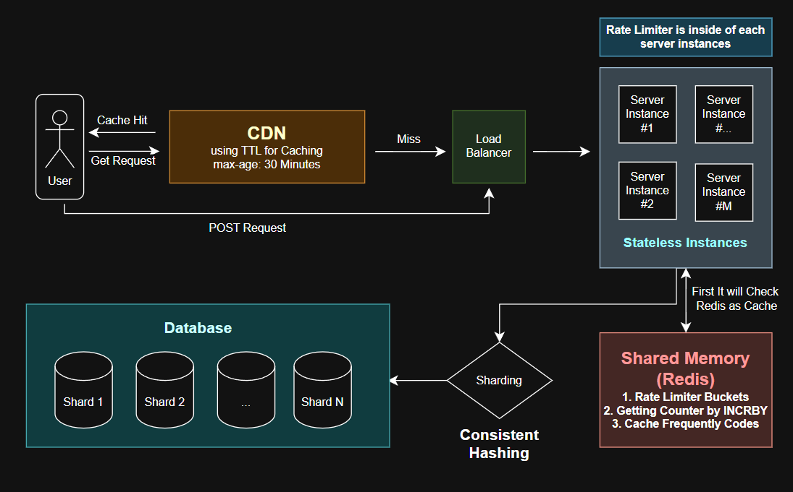

# Design Decisions

## Part 1
- **How you decide two URLs are “the same” (normalization: trailing slash, case, etc.)?**
URL stored after normalization by function `Normalize` in `internal/functions.go` file.
1. Check protocol (should be http/https)
2. Sort query to not store it multiple times (?a=1,b=2 is same as ?b=2,a=1)
3. Delete the fragment section (it does not represent the resource and it is a local browser info)
4. Taking care of slashes (links have path -> delete last slash , links with no path -> have only one slash). this will help to not store same thing twice. e.g https://example.com or https://example.com/ -> https://example.com/ 
https://example.com/sample or https://example.com/sample/ -> https://example.com/sample/
5. Lowercases the host section and NOT changing the path section (because it is case sensetive)

- **How same URL → same code is stored (e.g. long URL → code index)?**
This mapping is stored with an struct `Store`. After normalization the url and its generated code will be save inside struct with two hashmaps `longUrlToCode` and `codeToLongUrl`. By help of these two map and normalization, same url will always return same code. (The idempotency is tested by `TestIdempotency` in `cmd/server/server_test.go`)

- **How codes are generated for new URLs only?**
Code is generated by function `EncodeToBase62String` in `internal/functions.go` file. This function is getting `uint32` number and returning an string by getting remainder of number. It will take remainders into an array and change them to  charactars with help of `const validChar` which indicates 62 valid charactars.
The store has a counter (input of encode function) which is used for generating new codes. 
The start number for counter is 916132832 (62^5) because we need at least 6 charactars. (first input gives us `100000` in base62) For the upper bound which is 8 charactars (62^7), for now we have uint32 and it is smaller than our output so we will not be conserend about it. (The counter has limitation on max.uint32 and cannot be above it: generator function will throw `ErrMaxUrlReached` error)
62^5 < max.uint32 < 62^7

So our system is creating a code with **length of 6**only which is enough and its around 3.37B of numbers:
> 4,294,967,295 (uint32 max) - 916,132,832 (62^5) = 3,378,834,463

- **Collision handling?**
This system does not have collisions because it generate the code with a single counter. But it has its downsides like people can found other links easily.

- **Mutex type and which methods lock?**
I've used `sync.RWMutex` for Store struct because sometimes we only need to have Rlock which is faster than locking all resource with Lock. (100:1 R:W ratio in url shortener systems)

- **Package layout?**
`cmd/server`: Http Handling Endpoints + Http Objects (indicate format of response and request) + Test/Benchmarks
`fakeStore`: Mock/Fake Store Implementation for Testing StoreInterface
`store`: Memory Store Implementation + Tests
`storeDB`: Database Store Implementation + Tests
`internal`: Functions + Errors + Types (Error and Types may be used in many parts of system so they should be in a particular package)

## Part 2
- **Store interface location and methods.**
I've declared the inreface inside server main section `main.go`:
(it has two method which is only functions we need for endpoints)
```bash
type StoreInferface interface {
	GetShortCode(url string) (code string, err error)
	GetLongUrl(code string) (urlObj internal.UrlInfo, err error)
}
```
This is a declared structure for any store implementation (in my project there is `store`, `fakeStore` and `storeDB`)
User can choose the type of storing method which is memory/db by its flag:

```go
var storeOption StoreInferface
	switch *storeFlag {
	case "memory":
		storeOption = store.New()
	case "db":
		storeOption = initDb()
	default:
		log.Fatal("invalid storing option")
	}
	// the interface is getting 'store' object
	srv := server{
		store:   storeOption,
		baseUrl: "",
	}
```

- **How errors become status codes and response bodies.**
All errors are declared in `internal/errors.go` which is better for project structure. 
Differenet type of errors can happen but they are wrapped in a general error, for example in `GetShortCode` in `store/store.go`:
```go
normalizedUrl, err := internal.Normalize(longUrl)
	if err != nil {
		// err could be: ErrInvalidProtocol, ErrBadFormat, ErrEmptyHost, ErrEmptyInput
		return "", fmt.Errorf("%w: %w", internal.ErrInvalidURL, err)
	}
```
and after it returns to main file which is where handler located: (main error will not be returned to user and with wrapping we only return codes like 400/404/500/503)
```go
code, err := s.store.GetShortCode(req.Url)
	if err != nil {
		switch {
		case errors.Is(err, internal.ErrInvalidURL):
			http.Error(w, "Given url is invalid", http.StatusBadRequest) // 400
		case errors.Is(err, internal.ErrMaxUrlReached):
			http.Error(w, "Service is not available for now", http.StatusServiceUnavailable) // 503
		default:
			http.Error(w, "Internal Server Error", http.StatusInternalServerError) // 500
		}
		return
	}
```

```go
urlObj, err := s.store.GetLongUrl(code)
	if err != nil {
		if errors.Is(err, internal.ErrNotFound) {
			http.Error(w, "URL not found", http.StatusNotFound) // 404
			return
		} else if errors.Is(err, internal.ErrCodeInvalidLength) {
			http.Error(w, "Given code is not valid", http.StatusBadRequest) // 400
			return
		}
		http.Error(w, "Internal server error", http.StatusInternalServerError) // 500
		return
	}
```

## Part 3
- **Locking choice?**
I have used `sync.RWMutex` over a simple `sync.Mutex` because URL shortener deal with read-heavy operations (100:1 R:W ratio). 
Using `RLock()` allows multiple concurrent requests to read from the maps in parallel without blocking each other.

- **Timeout values and expected slow-client behavior.**
All timeout values for configure http server is located on top of the main code
```go
// based on cloudflare maximum url length
const MAX_URL_LENGTH = 32768
// timeout enviroment
const READ_TIMEOUT_SEC = 5
const READ_HEADER_TIMEOUT_SEC = 3
const WRITE_TIMEOUT_SEC = 10
const IDLE_TIMOUT_SEC = 60
const MAX_HEADER_SIZE = 16384
```
- **READ_HEADER_TIMEOUT_SEC**+ **READ_TIMEOUT_SEC**: Avoid hanging connections from slowloris attacks or stalled requests.
- **WRITE_TIMEOUT_SEC**: Prevents from getting stuck writing responses to slow clients.
- **IDLE_TIMOUT_SEC**: Closes idle keep-alive connections to free resources.
- **MAX_URL_LENGTH**(32KB): Not processing heavy oversized JSON requests.
- **Slow-client behavior**: With help of mentioned configurations, if a client sends headers, uploads the body, or reads the response too slowly, the server forcefully closes the TCP connection and frees resources

- **Eviction cap (if any)**
As I mentioned in part 1, this system has `ErrMaxUrlReached` error which is an error indicates limitation on number of URLs can be inserted. Lower limit is 62^5 which is needed for creating at least 6 charactars in base62. With following calculations, we can store around `3.37B` number of URLs in this system. 
> 4,294,967,295 (uint32 max) - 916,132,832 (62^5) = 3,378,834,463

## Part 4
- **Storage choice: GORM + which DB, or file format.**
I have used GORM+Sqlite because this system is considered for a signle machine and sqlite is enough for its simplicity. But if we want to scale out it we cannot use sqlite and a more complex db like PostgreSql must be used.
Unlike previous implemention we don't need two map and all information is stored in a single table and a single struct which holds the table:
```go
type UrlRow struct {
	ID        uint      `gorm:"primaryKey"`
	Code      string    `gorm:"uniqueIndex;not null"`
	LongURL   string    `gorm:"uniqueIndex;not null"`
	CreatedAt time.Time `gorm:"autoCreateTime"`
}
type SqlStore struct {
	db      *gorm.DB
	mu      sync.Mutex
	counter uint32
}
```

- **Schema/models and migrations (if GORM).**
`db.AutoMigrate(&UrlRow{})` runs at startup and creates the table with unique indexes on `code` and `long_url`. No separate migration files needed, because there is only one table. So if the schema changes **frequently**in future, a real migration tool (like golang-migrate) is needed. e.g. if you add a new column or add a new table, migration file is needed for sure.

- **Crash safety and atomicity.**
The 201 is sent only after `db.Create` finishes (GORM wraps it in a transaction, SQLite commits it atomically). `counter` increases only after a successful insert, and after a restart it is recalculated from the last row id, so nothing is lost.

- **How created_at is stored.**
`CreatedAt` is a `time.Time` field. I set it in code with `time.Now().UTC()`, so all times are in UTC no matter the server timezone. SQLite saves it as a datetime value and GORM reads it back as `time.Time`. The HTTP layer formats it as `RFC3339` in the metadata route.

- **Idempotency (Part 1 rule) + persistence: same URL after restart → same code.**
Idempotency and Restart Conditions are satisfied, you can check two tests: `TestRestart` and `TestIdempotency` in `storeDB/storeDB_test.go`
The second request for a URL finds it with `long_url` and returns the old code. After restart the data is still in the DB, and the counter continues from the last id, so new URLs don't reuse old codes.


## Part 5
**High Level Design Diagram**
<p align="left">
  
</p>

---
توضیحات طراحی: (به دلیل سادگی در فارسی نوشته شده است)

در ابتدا درخواست های GET کاربر که قابلیت Cache شدن دارند را به CDN ارسال می کند در اینجا درخواست ها به مدت زمان 30 دقیقه باقی می مانند تا اگر فرد دیگری درخواست داد نیازی به پردازش در سرور نباشد. (همچنین در این پروژه ما ریدایرکت را با کد 302 انجام می دهیم که تغییر Location به صورت موقت است اما اگر 301 و به صورت همیشگی بود، این ریدایرکت در مرورگر کاربر ثبت میشد و دیگر امکان Invalid کردن آن لینک یا جمع آوری اطلاعات مربوط به آن را نداشتیم.)
برای دیلیت یا Invalid کردن یک لینک نیز می توان به CDN دستور Purge ارسال کرد تا دیگر آن را به کاربر ارسال نکند.

در صورت در دسترس نبودن منبع درخواستی یا ارسال درخواست POST، به بخش Load Balancer می رویم که از Instance ها یکی انتخاب شده و درخواست به آن ارسال می شود. (در اینجا میتونیم از Round Robin استفاده کنیم چون که همه سرور ها یکسان و هم قدرت فرض شدند اما اگر برخی سرور ها قدرت بالاتری دارند می توان از Weighted RR یا Least Connections هم استفاده کرد.)
با توجه به داشتن چندین Instance دیگر نمی توان از دیتابیس ای مثل Sqlite استفاده کرد چرا که باید هر سرور stateless باشد و اطلاعات را در خودشان ذخیره نکنند در نتیجه نیازمند Redis و PostgreSQL خواهیم بود.

از این جا به بعد مسیرهای GET و POST از هم جدا می‌ شوند: در مسیر GET فقط چک Cache و در صورت Miss شدن، جستجو در شارد مربوطه انجام می‌ شود و Rate Limiter روی آن اعمال نمی‌ شود. اما در مسیر POST ابتدا Rate Limiter، سپس قفل Race و بعد چک کل شارد ها انجام می ‌شود و در واقع POST اصلا سراغ Cache نمی‌ رود.

در مسیر درخواست POST، بخش Rate Limiter داخل آن Instance قرار دارد و دیتا آن در یک حافظه مشترک یعنی Redis ذخیره شده تا هر instance بتواند وضعیت را به صورت به روز داشته باشد. برای ساخت کد نیز اگر هر سرور Counter مستقل خودش را داشته باشد، ممکن است دو Instance برای دو URL متفاوت یک کد یکسان تولید کنند. در نتیجه برای این مشکل، به هر Instance با کمک INCRBY بازه های مشخصی از Counter به آن سرور داده می شود تا در همان رنج داده شده کار کند و در واقع هر Instance متغیر Counter خودش را داشته باشد. (همچنین اگر رنج داده شده تمام شود یک رنج جدید می گیرد و در صورت کرش کردن یک Instance مشکل خاصی به وجود نمی آید و بخش کوچکی از Counter از دست می رود که می توان صرف نظر کرد.)

در مسیر درخواست GET، در ابتدا در حافظه مشترک بررسی می شود که آیا درخواست فعلی در Cache آن قرار دارد یا خیر در غیر این صورت به بخش Sharding می رویم. (در اینجا سیاست Cache را می توانیم LRU بگذاریم چرا که لینک هایی که مدت زیادی مصرف نشده اند را حذف می کند و مناسب سیستم فعلی است. الگوریتم LFU هم جزو گزینه ها ممکن است باشد اما لینک قدیمی ای که قبلا بسیار استفاده شده را حذف نمی کند. همچنین Cache در Redis نیاز به TTL دارد که می توانیم مقدار 24 ساعت را در آن قرار دهیم.)

در Sharding از تکنیک Consistent Hashing استفاده شده تا در صورت تغییر تعداد دیتابیس دچار تغییرات عمده نشویم که به طور میانگین 1/N از داده ها دچار جا به جایی می شوند. همچنین ما دو نوع درخواست داریم که GET , POST هستند و نسبت 100:1 نشان می دهد که GET اهمیت بالاتری دارد. به همین خاطر ما با هش کردن کد (چیزی که از Counter ساختیم) یعنی hash(code) شارد مد نظر را انتخاب کرده و در داخل آن جستجو می کنیم اما برای درخواست های POST باید تمامی شارد ها بررسی شوند تا URL تکراری در دیتابیس ها ذخیره نشود. البته می توان به طور موازی کوئری را اجرا کرد که زمان اجرای آن برابر با طولانی ترین زمان اجرای کوئری روی یک شارد است. (این هزینه ای هست که برای برقراری Idempotency میدیم. در غیر این صورت می توانستیم از جدول دومی استفاده کنیم و با hash(long_url) آن جداول را پیدا کنیم اما با توجه به جدا شدن مپ code -> long url و long url -> code به احتمال بالا idempotency از بین خواهد رفت.)

حالا در این شرایط ممکن است دو کاربر همزمان درخواست مشابه بفرستند در نتیجه باید URL ارسال شده را برای یک مدت محدود لاک کنیم تا دچار Race Condition نشویم. در اینجا از قابلیت قفل (SET key value NX EX) در Redis استفاده می کنیم و hash(long_url) را برای یک مدت زمان مشخص (20 ثانیه) قفل می کنیم تا تنها یک کاربر در یک زمان درخواستش بررسی شود.

---

**`DECISIONS.md`: LB → N apps → shared store**
Explained in upper text section

**CDN / edge caching for redirects**
Explained in upper text section

**Write-path scaling (rate limit, queue, or code pool)**
I've used rate limit + code pool:

- **Rate limit:** Each instance rate limits POST requests per client IP, with counters in shared Redis so all instances see the same state.
- **Code pool:** Each instance takes a block of counter (specific range like 1-100) values from Redis with `INCRBY` and makes codes from its own block.
- **Queue:** No need here: The user needs the short link in his request (send req + get res, not waiting for res), and the code pool already removes the main bottleneck. A queue would fit better for an analysis work like click counter. (using queue like kafka for processing that)

**Sharding / partitioning strategy**
Explained in upper text section


## Part 6

- **Shutdown drain; in-flight requests.**
Graceful shutdown is implemented in `setupHttpServerConfiguration` in `cmd/server/main.go`.
The flow is:
1. `ListenAndServe` runs inside a goroutine, so the main goroutine is ready to wait for a signal.
2. `signal.Notify` waits for `Ctrl + C` or a terminate singal `SIGTERM`
3. After signal, `httpServer.Shutdown(ctx)` is called with a context of **10 seconds** timeout. It closes the listener (no new connection is accepted) and waits for in-flight requests to finish.
4. `http.ErrServerClosed` is the normal result of `ListenAndServe` after shutdown, so it is not treated as an error. (in other words we dont treat this error as an unexpected error)


- **Rate limit parameters**
Rate limit is only applied on `POST /api/shorten`

## The algorithm i've used is `Token bucket per IP`
It lets me control burst (`RATE_BURST = 10`) and average rate (`RATE_PER_MINUTE = 30`) separately, so a normal user can create a few links fast but can't spam. Fixed window algorithm has the boundary problem, and sliding window counter doesn't give a separate burst size. Also it needs only two values per IP and more memory. The tradeoff is that state located in memory, so with multiple instances we need Redis (as I explain in Part 5).

Redirect `GET /{code}` and metadata route are not limited because they are the read-heavy part (100:1) and cheap. But they should have a fair limit and be aware of Ddos attacks.
```go
const RATE_PER_MINUTE = 30
const RATE_BURST = 10
const CLEANUP_LIVING_TIME_MINUTE = 10
```
- **30/min** = 0.5 token per second refill. Formula: `newToken = min(burst, lastTokens + time * rate)`
- **Burst 10**: a new IP starts with a full bucket, so a normal user can create 10 links quickly.
- **Over the limit Response** → `429 Too Many Requests` with `Retry-After` header (seconds until bucket reaches exactly 1 token).
- **Cleanup**: every minute a goroutine deletes buckets which are not used for 10 minutes, so the data in map doesn't stay there forever with old IPs.
- **Mutex Lock**: simple `sync.Mutex` (not RWMutex) because every request writes to its bucket, so there is no read-only path.
- `timeFunction` is injected, so tests move time manually (no `time.Sleep`). Tests: `TestTokenBucket`, `TestCleanup`, `TestRateLimiterGateway`.

---

- **Blocklist rules**
Not implemented in code, only the policy is decided here:
1. **Only http/https** (already satisfied by `Normalize`). Other protocols are rejected.
2. **No credentials in URL**: `https://google.com@fakeGoogle.com` looks like google but after shorten people won't be able to detect difference. (Phishing)
3. **No localhost or private ranges** (`127.0.0.0/8`, `192.168.0.0/16` and ...). Real services use domain names, and a short link to an internal address is only useful for abuse. 
4. **No links to our own host** (`-base` host): it will prevent from a loop situation.
5. **Domain blocklist**: the list would come from a public feed like Google Safe Browsing. It can be downloaded periodically.

Problem: a blocklist is never complete (new bad domains are unknown). Also the check runs only on create, so old links to a domain that is blocked later still work.


- **Log System Policy**
**What I log:** server lifecycle messages like starting, shutdown and errors. For requests, only method, path pattern (like `/{code}`), status code, and creation time.
**What I never log:** the full long URL (it can have tokens or passwords in query string, e.g. `?token=abc`), and the request body. If a URL is needed for debugging, only the host is logged. 

**Important Note:** Because codes are sequential, anyone can guess other people's links just by trying the next codes (`100001`, `100002`, ...). So a private link is not safe in this system. Random codes would fix this, but it is a different design (it needs collision handling). My approach is fine when all links are public anyway, e.g. a website like Digikala shortening its own product pages: guessing them doesn't expose anything.

- **Observability approach.**
Metrics/logging structured system are not implemented yet.