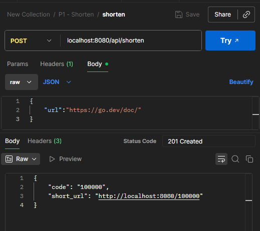
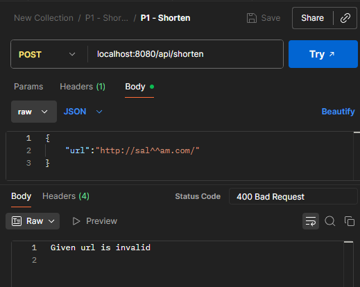
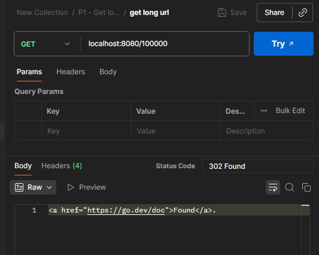
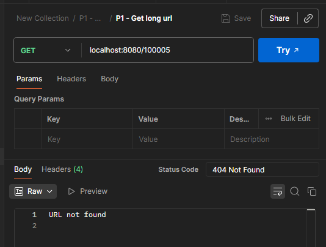
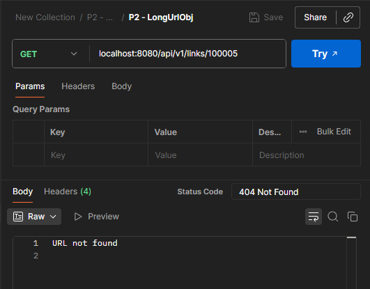
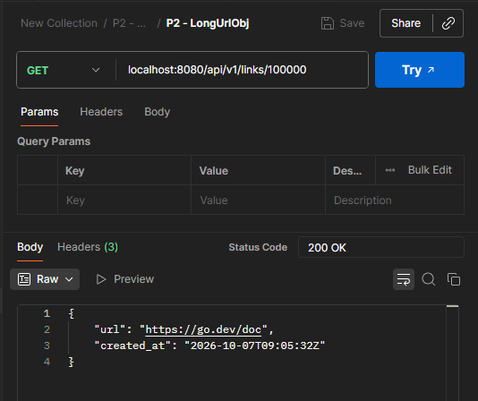
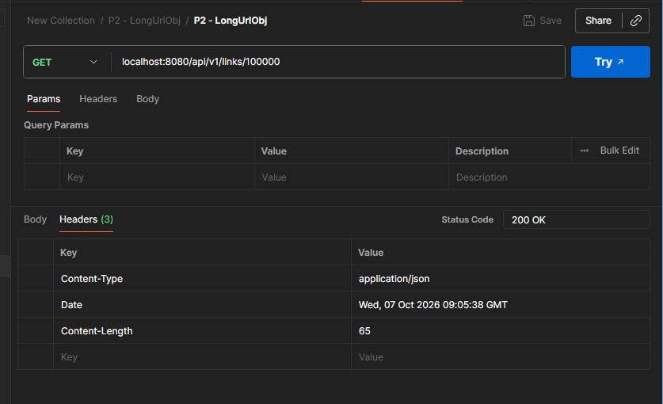
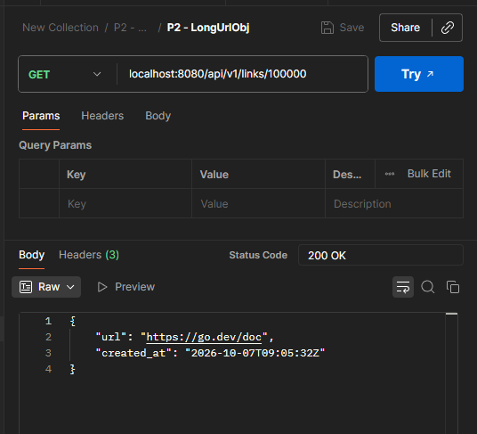
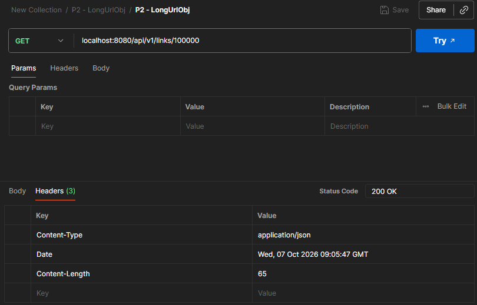

# Part 1
## How to run
You can get this repo from github or extracrt the zip file

after that: (in `starter` folder)
```bash
go run ./cmd/server -db=memory
```
Default value for db flag is `memory` , you can change it to `db` for using database
Addr flag can be set by `-addr` flag and its default is `:8080`
Base flag can be set by `-base` flag and its default is `http://localhost:8080`

## How to send requests

- Linux/Bash:
```bash
curl -s -X POST localhost:8080/api/shorten \
  -H 'Content-Type: application/json' \
  -d '{"url":"https://go.dev/doc/"}'
```

```bash
curl -L "http://localhost:8080/100000"
```

```bash
curl -L localhost:8080/api/v1/links/100000
```

- Windows
```bash
Invoke-RestMethod -Method Post `
  -Uri "http://localhost:8080/api/shorten" `
  -ContentType "application/json" `
  -Body '{"url":"[https://go.dev/doc/](https://go.dev/doc/)"}'
```

```bash
Invoke-WebRequest -Uri "http://localhost:8080/100000" -MaximumRedirection 0
```

```bash
Invoke-RestMethod -Uri "http://localhost:8080/api/v1/links/100000"
```

## Example requests and responses (via Postman)
### Shorten URL Endpoint

<p align="left">
  
  
</p>

---

### Get Long URL Endpoint

<p align="left">
  
  
</p>

---

### Get Link Object Endpoint (`created_at`)

<p align="left">
  
  
</p>
<p align="left">
  
</p>

---

### Idempotency & Creation Time Verification

<p align="left">
  
  
</p>

# Part 2 
## Idempotency Note
This rule is satisfied and checked by test `TestIdempotency` in `server_test.go`
```bash
Running tool: C:\Program Files\Go\bin\go.exe test -test.fullpath=true -timeout 30s -run ^TestIdempotency$ url-shortener/cmd/server

ok  	url-shortener/cmd/server	1.945s
```


# Part 3
# Benchmarks
## Running All Benchmarks:
```bash
go test -run=NONE -bench . -benchmem ./... -count 3
```
> goos: windows
goarch: amd64
pkg: url-shortener/cmd/server
cpu: Intel(R) Core(TM) i7-9750H CPU @ 2.60GHz

| Benchmark | Iterations | ns/op | B/op | allocs/op |
| :--- | :---: | :---: | :---: | :---: |
| BenchmarkShortenUrl-12 | 220830 | 5314 | 2397 | 20 |
| BenchmarkShortenUrl-12 | 262078 | 4741 | 2538 | 20 |
| BenchmarkShortenUrl-12 | 302044 | 4494 | 2484 | 20 |
| BenchmarkGetLongUrlDiff-12 | 612687 | 2057 | 1264 | 14 |
| BenchmarkGetLongUrlDiff-12 | 586474 | 2398 | 1264 | 14 |
| BenchmarkGetLongUrlDiff-12 | 591837 | 2103 | 1264 | 14 |
| BenchmarkGetLongUrlSame-12 | 698115 | 1623 | 1264 | 14 |
| BenchmarkGetLongUrlSame-12 | 613370 | 1874 | 1264 | 14 |
| BenchmarkGetLongUrlSame-12 | 715468 | 2160 | 1264 | 14 |

## Running Benchmarks on profiles

I have change a part of code which saw it as a bottleneck in flame graph:
Before Change:
```go
//this is standard approach using http redirect
http.Redirect(w, r, urlObj.LongUrl, http.StatusFound)
```
After Change
```go
w.Header().Set("Location", urlObj.LongUrl)
w.WriteHeader(http.StatusFound) // 302
```

## Insight
http.Redirect has some overhead in compare to normal and simple setting headers.
Replacing it with simple code, dropped **allocs/op by 36% (14 → 9), B/op by 24%, and latency by around 30%**. 

**Tradeoff**: Skips the HTML body creation and URL fixing (redirect funtion validate URL which is not neccessary because we've already validate urls in our database)

You can see the decrease number of allocs/op in two tables below: 

### Before Change
```bash
go test -run=NONE -bench . -count 3 -cpuprofile cpu.out -memprofile mem.out ./cmd/server/
```
> goos: windows
goarch: amd64
pkg: url-shortener/cmd/server
cpu: Intel(R) Core(TM) i7-9750H CPU @ 2.60GHz

| Benchmark | Iterations | ns/op | B/op | allocs/op |
| :--- | :---: | :---: | :---: | :---: |
| BenchmarkShortenUrl-12 | 220830 | 5314 | 2397 | 20 |
| BenchmarkShortenUrl-12 | 262078 | 4741 | 2538 | 20 |
| BenchmarkShortenUrl-12 | 302044 | 4494 | 2484 | 20 |
| BenchmarkGetLongUrlDiff-12 | 612687 | 2057 | 1264 | 14 |
| BenchmarkGetLongUrlDiff-12 | 586474 | 2398 | 1264 | 14 |
| BenchmarkGetLongUrlDiff-12 | 591837 | 2103 | 1264 | 14 |
| BenchmarkGetLongUrlSame-12 | 698115 | 1623 | 1264 | 14 |
| BenchmarkGetLongUrlSame-12 | 613370 | 1874 | 1264 | 14 |
| BenchmarkGetLongUrlSame-12 | 715468 | 2160 | 1264 | 14 |

### After Change
```bash
go test -run=NONE -bench . -benchmem ./... -count 3
```
> goos: windows
goarch: amd64
pkg: url-shortener/cmd/server
cpu: Intel(R) Core(TM) i7-9750H CPU @ 2.60GHz

| Benchmark | Iterations | ns/op | B/op | allocs/op |
| :--- | :---: | :---: | :---: | :---: |
| BenchmarkShortenUrl-12 | 286368 | 5100 | 2503 | 20 |
| BenchmarkShortenUrl-12 | 286015 | 4632 | 2504 | 20 |
| BenchmarkShortenUrl-12 | 312718 | 4437 | 2471 | 20 |
| BenchmarkGetLongUrlDiff-12 | 803960 | 1332 | 960 | 9 |
| BenchmarkGetLongUrlDiff-12 | 675120 | 1744 | 960 | 9 |
| BenchmarkGetLongUrlDiff-12 | 909835 | 1663 | 960 | 9 |
| BenchmarkGetLongUrlSame-12 | 1044564 | 1210 | 960 | 9 |
| BenchmarkGetLongUrlSame-12 | 1000000 | 1095 | 960 | 9 |
| BenchmarkGetLongUrlSame-12 | 807042 | 1355 | 960 | 9 |
